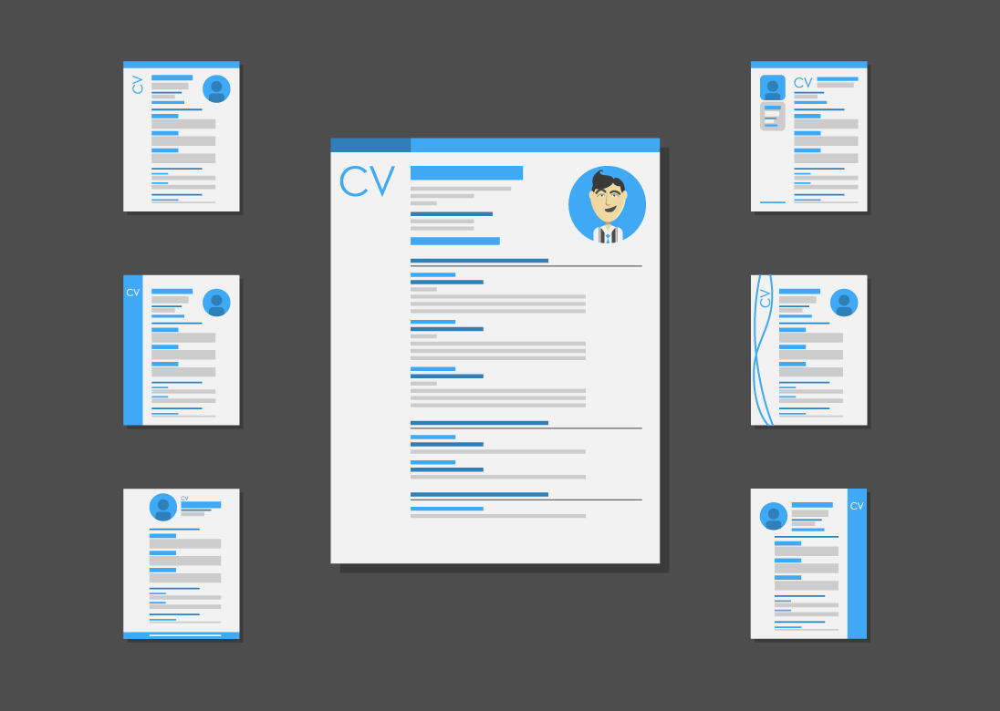

# CV Photo Header Blue



## Information

Elegant and minimal resume/CV template for designers, developers and professionals in any industry.

Simple and professional layout for maximizing your impression.

Simply input your data and sent to print.

All layers are grouped separately and organized according to sections.

All text layers are created as smart object, just update with your data and click save to update.

If you have further questions than don’t hesitate to contact: ```email@franciscocalisto.me```

### Features

A4 size (0.25 inch bleed)
300 dpi, print ready
3 PSD files, CMYK color
Black, White and Green
Easy to edit, fully customizable

#### Files Include

1 PSD
1 JPG

#### Font Used

Lato ([link](https://www.fontsquirrel.com/fonts/lato))

> No images are provided.
